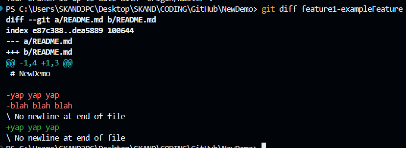
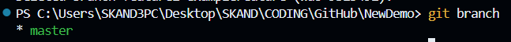
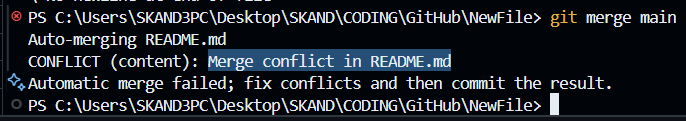
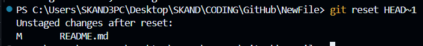

# **git clone <SSH ID>**         
    # pulls your github project to the local directory

# **git config --global user.email "you@example.com"**     
    # self explanotrii

# **git config --global user.name "Your Name"**
    # self explanotrii

# **cd GitHub**                  
    # change directory to "\GitHub"

# **cd demo1**                   
    # change directory to "GitHub\demo1"

# **git status**                 
    # shows current status of your repo, whether its up to date with the local file or not
        ____
    # "modified" : existing file will have some changed that are not tracked

# **git add .**                  
    # tracks all the changes made ("." represents ALL files u want to track), can also mention specific file names
        ____

# **git commit -m "pls work"**   
    # uploads your edited repo locally; "-m" represents a MANDATORY-to-insert message, use it to tell why the  change was made, this is shown as TITLE on your GH

# **git commit -m "pls work" -m "this is an edit"**
    # the second "-m" adds actual description to the change in GH 
        ____

# **git push**
    # actually pushes and uploads your file to GH account
        ____

# **cd ..**
    # to roll back to the previous folder

# **git init**
    # initialises an empty Git repository if u make a folder locally then want to push to GH
        ____

# **Origin push error**
    # Git is trying to say that the file that has to be pushed to origin can not be found, thats because we made it locally so git has nowhere to show that on GH
        ____

# to deal with this you have these options: 
    1. Manually create a new EMPTY repo on GH then do this:
        ____

# **git remote add origin <REPO ID>**
    # sets the new empty repo to origin

# **git remote -v**
    # shows all remote repositories linked with the in-use repo

# **git push -u origin master**
    # the "-u" adds an upstream, i.e, it sets "origin master" to the default push place so u dont have to type it again n again after this

# ✨____⭐

# **git branch**
    # checks and tells you what branch you are on, master is the main branch and other branches will be the side branches of the project
        ____

# **git checkout -b <BRANCH_NAME>**
    # makes and switches yourself to the new branch
        ____

# **git checkout <BRANCH_NAME>**
    # switches you to another branch you want to go to (doesnt make a new one)
        ____

# **git diff**
    # shows the differences of changes
        ____
        ____

# PR = pull request
    # when you push a change from your local machine, it hints you to set up a pull request for that branch on GH by visiting the link, it also provides you the link itself
    ____
    ____

# The arrow denotes which branch is merged into which branch, so the feature1... branch is being merged into MASTER
    ____

# even after this the changes wont be in your local machine until you pull them from GH first

# **git branch -d feature1...**
    # deletes the branch
        ____

# **git commit -am**
    # Helps to commit and add message to a modified file, WILL not work for newly created files.

# Merge conflicts
    ____
    ____

# Now you can either use GitHub to fix the merge conflicts or you can just use the options provided in the code editor

# The top line shows the changes from the branch we are currently on
    ____

# The bottom line shows the changes coming from other branches
    ____

# Just manually delete the extra lines and make the code how you want it to be
    ____

# **git reset**
    # this helps you to UNDO a particular (specify nameof file) or all changes in files.
    ____

# **git reset HEAD~n**
    # this helps to unstage a COMMIT entirely
    ____

# The *~1* part after the HEAD text shows how many commits u wanna go back. We skip over the commit we accidently made and go back to the previous commit that didnt have any problmes for us.

# **git log**
    # this will show you all the commits that were made to the repo (latest to oldest order) so u can see how many commits u wanna go back

# say u have a beef with the latest commit (____) 

# copy the code for that commit (*980cf5c369231e2a03228fb9cd76430890221a2b*) and use **git reset** *number u copied*

# **git reset --hard <log number>**
    #this will HARD REMOVE all the changes after a certain point not just unstage them